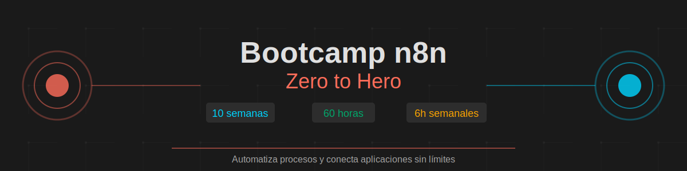

# Bootcamp n8n: Zero to Hero



## 🎯 Descripción

Bienvenido al **Bootcamp n8n Zero to Hero**, un programa intensivo de 10 semanas diseñado para llevarte desde cero hasta convertirte en un experto en automatización de procesos con n8n.

Con solo **6 horas semanales de dedicación** (60 horas totales), aprenderás a crear workflows poderosos, integrar aplicaciones, y automatizar procesos empresariales sin necesidad de ser programador.

## 📊 Estructura del Bootcamp


### Distribución del Tiempo

- **📚 Teoría:** 30% (18 horas) - Conceptos fundamentales
- **💻 Práctica guiada:** 40% (24 horas) - Implementación supervisada
- **🚀 Proyectos:** 30% (18 horas) - Casos reales y proyecto final

## 🗓️ Los 4 Módulos

### [Módulo 1: Fundamentos de n8n](./modulos/modulo-01-fundamentos/)

**Semanas 1-2.5 | 15 horas**

Aprende los conceptos básicos de n8n, configura tu entorno y crea tus primeros workflows.

**Aprenderás:**

- ✅ Qué es n8n y casos de uso
- ✅ Instalación y configuración
- ✅ Interfaz y navegación
- ✅ Nodos básicos y conexiones
- ✅ Primeros workflows funcionales

**Entregables:** 3 workflows básicos + documentación de instalación

---

### [Módulo 2: Nodos y Manejo de Datos](./modulos/modulo-02-nodos-datos/)

**Semanas 2.5-5 | 15 horas**

Domina los nodos principales, triggers y transformación de datos.

**Aprenderás:**

- ✅ Nodos core (HTTP, Set, IF, Switch)
- ✅ Triggers (Webhook, Schedule, Email)
- ✅ Expresiones y funciones
- ✅ Transformación de JSON
- ✅ Gestión de credenciales

**Entregables:** 5 workflows con triggers + sistema de transformación

---

### [Módulo 3: Workflows Intermedios](./modulos/modulo-03-workflows-intermedios/)

**Semanas 5-7.5 | 15 horas**

Implementa lógica compleja e integra servicios populares.

**Aprenderás:**

- ✅ Lógica condicional compleja
- ✅ Loops y arrays (Split In Batches)
- ✅ Integraciones (Google Sheets, Slack, APIs)
- ✅ Error handling robusto
- ✅ Sub-workflows

**Entregables:** Sistema de notificaciones + workflow de sincronización

---

### [Módulo 4: Nivel Avanzado y Proyecto Final](./modulos/modulo-04-nivel-avanzado/)

**Semanas 7.5-10 | 15 horas**

Programa con JavaScript, optimiza workflows y desarrolla tu proyecto final.

**Aprenderás:**

- ✅ Code nodes (Function, Function Item)
- ✅ JavaScript para transformaciones
- ✅ Optimización de performance
- ✅ Versionado y backup
- ✅ Debugging avanzado

**Entregables:** Proyecto final integrador completo

---

## 📚 Documentación

Toda la documentación auxiliar está organizada en el directorio [`_docs/`](./_docs/):

- 📖 [Guía de Instalación](./_docs/guia-instalacion.md)
- 🧠 [Conceptos Fundamentales](./_docs/conceptos-fundamentales.md)
- 🔧 [Expresiones y Variables](./_docs/expresiones-y-variables.md)
- ⭐ [Mejores Prácticas](./_docs/mejores-practicas.md)
- � [Comandos Útiles](./_docs/comandos-utiles.md) - **¡Guía rápida de comandos!**
- 📝 [Conventional Commits](./_docs/conventional-commits.md)
- �🔍 [Troubleshooting](./_docs/troubleshooting.md)
- 🌐 [Recursos Externos](./_docs/recursos-externos.md)

## 🚀 Inicio Rápido

### Prerrequisitos

- Computadora con conexión a internet
- Navegador web moderno (Chrome, Firefox, Edge)
- Cuenta de correo electrónico
- (Opcional) Conocimientos básicos de lógica de programación

### Instalación

1. **Opción Cloud (Recomendado para empezar):**

   ```bash
   # Regístrate en n8n.io
   https://n8n.io/
   ```

2. **Opción Local (Docker):**

   ```bash
   docker run -it --rm \
     --name n8n \
     -p 5678:5678 \
     -v ~/.n8n:/home/node/.n8n \
     n8nio/n8n
   ```

3. **Opción Local (npm):**
   ```bash
   npm install n8n -g
   n8n start
   ```

Consulta la [Guía de Instalación completa](./_docs/guia-instalacion.md) para más detalles.

## 📊 Metodología de Aprendizaje

### Learn by Doing

Este bootcamp está diseñado con el enfoque **práctica primero**:

1. **Concepto breve** → 2. **Ejemplo práctico** → 3. **Ejercicio guiado** → 4. **Proyecto aplicado**

### Evaluación Continua

- **Semana 2.5:** Quiz de fundamentos + workflow básico
- **Semana 5:** Proyecto intermedio con integraciones
- **Semana 7.5:** Workflow complejo con error handling
- **Semana 10:** Proyecto final integrador (presentación)

## 🎓 Certificación

Al completar el bootcamp exitosamente:

✅ **Requisitos:**

- Completar los 4 módulos
- Entregar todos los ejercicios
- Presentar proyecto final
- Asistencia mínima del 80%

✅ **Obtienes:**

- Certificado de finalización
- Portfolio de workflows documentados
- Acceso a comunidad de egresados
- Material de referencia permanente

## 🛠️ Recursos Visuales

El bootcamp incluye recursos gráficos para reforzar el aprendizaje:


Todos los diagramas y recursos visuales están en [`assets/`](./assets/) en formato SVG.

## 📊 Métricas de Éxito

Nuestros objetivos para cada estudiante:

- ✅ **100%** completan 10+ workflows funcionales
- ✅ **90%** despliegan al menos 1 workflow en producción
- ✅ **80%** completan proyecto final integrador
- ✅ **Portfolio** de workflows documentados y compartibles
- ✅ **Capacidad** de resolver problemas reales con n8n

## 👥 Soporte

Durante el bootcamp tendrás acceso a:

- 💬 Sesiones de Q&A semanales
- 💼 Canal de Slack/Discord para dudas
- 📖 Biblioteca de workflows de ejemplo
- 🎯 Office hours 1-on-1 para casos complejos
- 🎥 Grabaciones de todas las sesiones (en `/videos/`)

## 🌟 ¿Por qué n8n?

- **Open Source:** Control total sobre tus automatizaciones
- **Self-hosted:** Tus datos permanecen privados
- **Extensible:** Crea tus propios nodos personalizados
- **Visual:** Diseño de workflows intuitivo
- **Comunidad:** Miles de workflows compartidos
- **Sin límites:** No hay restricciones en la versión self-hosted

## 📈 Casos de Uso Reales

Aprenderás a automatizar:

- 📧 Sistemas de notificaciones multi-canal
- 📊 Sincronización de datos entre aplicaciones
- 🤖 Bots de Slack/Discord/Telegram
- 📱 Integraciones con APIs REST
- 📅 Automatización de tareas recurrentes
- 💾 Backups y respaldos automáticos
- 📈 Reportes y dashboards automatizados

## 🗂️ Estructura del Proyecto

```
bc-n8n/
├── README.md                    # Este archivo
├── .gitignore                   # Exclusiones de Git
├── .github/
│   └── copilot-instructions.md  # Instrucciones para Copilot
├── _docs/                       # 📚 Documentación
├── modulos/                     # 📖 Contenido de los 4 módulos
├── assets/                      # 🎨 Recursos gráficos (SVG)
└── videos/                      # 🎥 Videos (no versionados)
```

## 🔗 Enlaces Útiles

- [Documentación Oficial de n8n](https://docs.n8n.io/)
- [n8n Community Forum](https://community.n8n.io/)
- [n8n Templates](https://n8n.io/workflows)
- [Canal de YouTube de n8n](https://www.youtube.com/@n8n-io)
- [GitHub de n8n](https://github.com/n8n-io/n8n)

## 📝 Licencia

Este material educativo está bajo licencia MIT. Siéntete libre de usar, modificar y compartir.

## 💌 Contacto

¿Preguntas? ¿Sugerencias? ¡Nos encantaría escucharte!

---

<div align="center">

**¡Comienza tu viaje de automatización hoy! 🚀**

[Ir al Módulo 1](./modulos/modulo-01-fundamentos/) | [Ver Documentación](./_docs/) | [Descargar Workflows](./modulos/)

</div>
