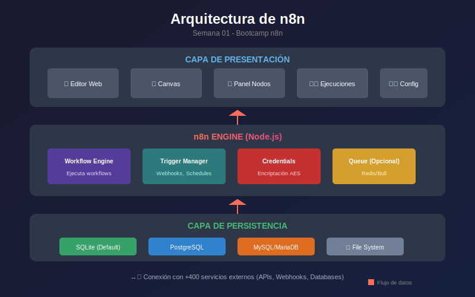
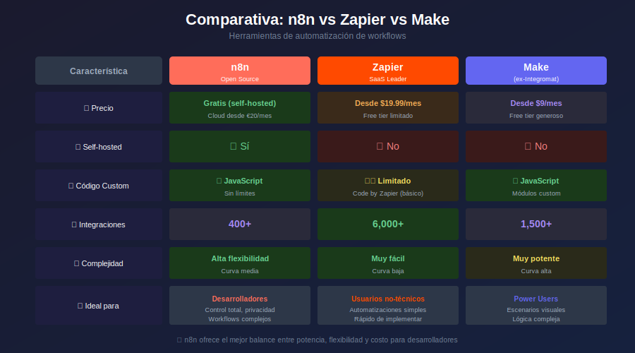

# 🎨 Assets - Semana 01

## Introducción a n8n y Automatización

---

## 📋 Diagramas Disponibles

| #   | Archivo                                                         | Usado en       | Descripción                                   |
| --- | --------------------------------------------------------------- | -------------- | --------------------------------------------- |
| 01  | [arquitectura-n8n.svg](01-arquitectura-n8n.svg)                 | Módulo 02      | Arquitectura general de n8n y sus componentes |
| 02  | [flujo-workflow-basico.svg](02-flujo-workflow-basico.svg)       | Práctica 04    | Flujo de datos en un workflow simple          |
| 03  | [interfaz-n8n.svg](03-interfaz-n8n.svg)                         | Práctica 03    | Componentes de la interfaz de usuario         |
| 04  | [comparativa-herramientas.svg](04-comparativa-herramientas.svg) | Módulo 02      | n8n vs Zapier vs Make                         |
| 05  | [docker-compose-stack.svg](05-docker-compose-stack.svg)         | Módulo 03      | Stack de Docker para n8n                      |

---

## 🖼️ Vista Previa de Diagramas

### 01 - Arquitectura de n8n



**Uso en documentación:**
```markdown

```

---

### 02 - Flujo de Workflow Básico


**Uso en documentación:**
```markdown

```

---

### 03 - Interfaz de n8n


**Uso en documentación:**
```markdown

```

---

### 04 - Comparativa de Herramientas



**Uso en documentación:**
```markdown

```

---

### 05 - Docker Compose Stack


**Uso en documentación:**
```markdown

```

---

## 📁 Estructura de Archivos

```
0-assets/
├── README.md                       # Este archivo
├── 01-arquitectura-n8n.svg         # Arquitectura general
├── 02-flujo-workflow-basico.svg    # Flujo básico
├── 03-interfaz-n8n.svg             # Interfaz de usuario
├── 04-comparativa-herramientas.svg # Comparativa
└── 05-docker-compose-stack.svg     # Stack Docker
```

---

## 🎨 Guía de Estilos

### Colores Utilizados

| Elemento    | Color      | Hex       |
| ----------- | ---------- | --------- |
| Fondo       | Oscuro     | `#1e1e1e` |
| n8n Primary | Rojo       | `#FF6D5A` |
| Accent      | Cyan       | `#00D4FF` |
| Success     | Verde      | `#00A86B` |
| Warning     | Naranja    | `#FFA500` |
| Text        | Gris claro | `#E0E0E0` |

### Especificaciones

- **Formato**: SVG (escalable)
- **Tema**: Dark mode
- **Fuente**: Sans-serif (Inter, Roboto)
- **Sin degradados**: Colores sólidos

---

## 📝 Notas de Uso

1. Todos los diagramas están optimizados para dark mode
2. Los SVG son editables con cualquier editor de vectores
3. Usar `` o `` para incrustar en Markdown
4. Mantener la nomenclatura `XX-nombre-descriptivo.svg`
