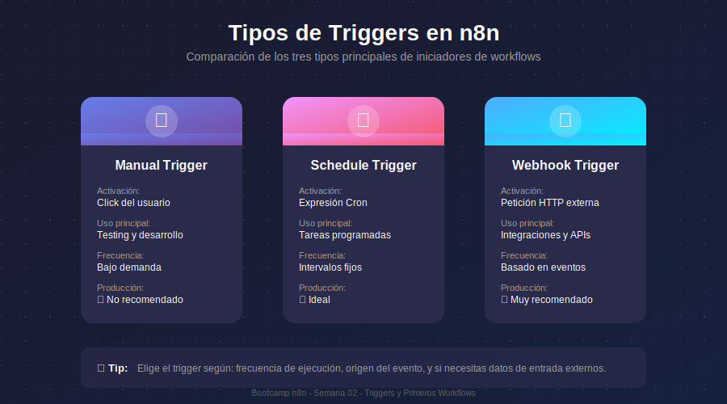
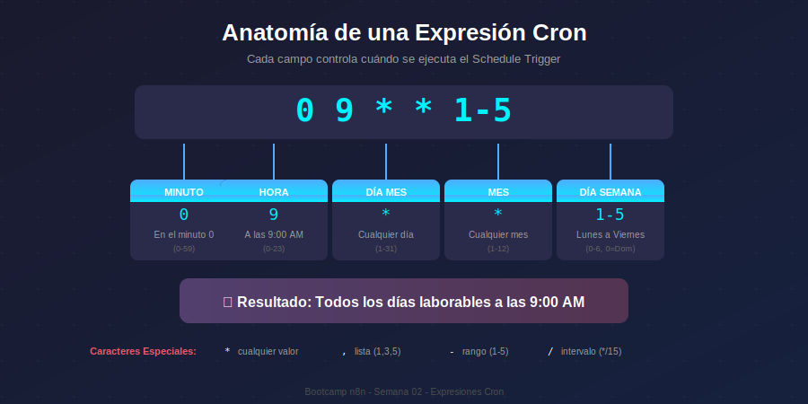
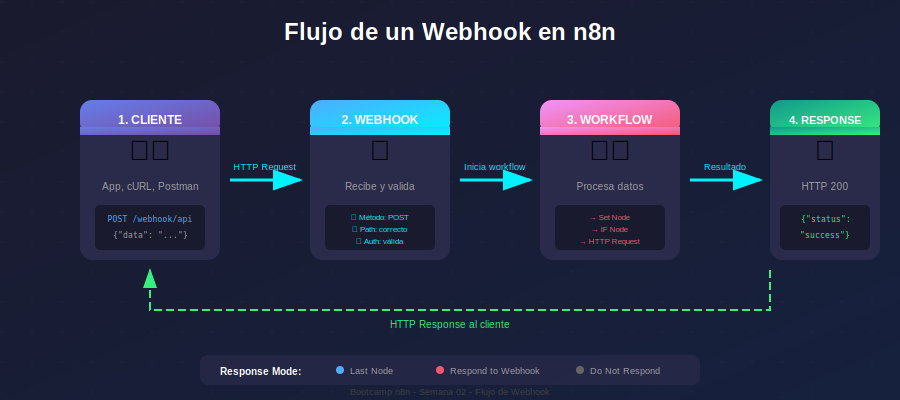
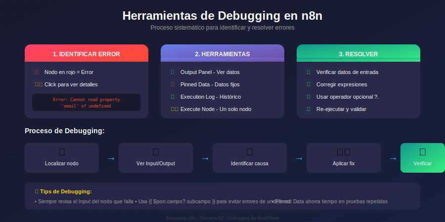
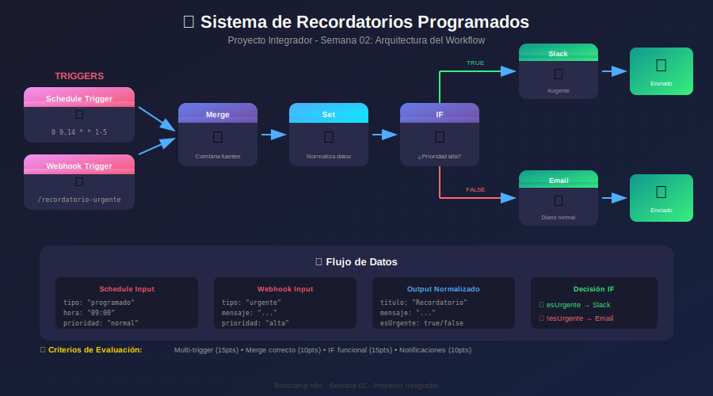

# 🎨 Assets - Semana 02

## Triggers y Primeros Workflows

---

## 📋 Diagramas Disponibles

| #   | Archivo                                                       | Usado en    | Descripción                        |
| --- | ------------------------------------------------------------- | ----------- | ---------------------------------- |
| 01  | [01-tipos-triggers.svg](01-tipos-triggers.svg)                | Módulo 01   | Comparativa de tipos de triggers   |
| 02  | [02-expresion-cron.svg](02-expresion-cron.svg)                | Módulo 02   | Anatomía de una expresión cron     |
| 03  | [03-flujo-webhook.svg](03-flujo-webhook.svg)                  | Práctica 03 | Flujo de un webhook en n8n         |
| 04  | [04-debugging-workflow.svg](04-debugging-workflow.svg)        | Módulo 03   | Herramientas de debugging          |
| 05  | [05-proyecto-recordatorios.svg](05-proyecto-recordatorios.svg)| Proyecto    | Arquitectura del proyecto semanal  |

---

## 🖼️ Vista Previa de Diagramas

### 01 - Tipos de Triggers



**Uso en documentación:**

```markdown

```

---

### 02 - Expresión Cron



**Uso en documentación:**

```markdown

```

---

### 03 - Flujo de Webhook



**Uso en documentación:**

```markdown

```

---

### 04 - Debugging de Workflows



**Uso en documentación:**

```markdown

```

---

### 05 - Proyecto Recordatorios



**Uso en documentación:**

```markdown

```

---

## 🎨 Guía de Estilos

### Paleta de Colores

| Color          | Código    | Uso                    |
| -------------- | --------- | ---------------------- |
| Fondo oscuro   | `#1a1a2e` | Background principal   |
| Fondo medio    | `#2a2a4a` | Cards y contenedores   |
| Púrpura        | `#667eea` | Manual Trigger         |
| Rosa           | `#f5576c` | Schedule Trigger       |
| Cyan           | `#00f2fe` | Webhook Trigger        |
| Verde          | `#38ef7d` | Éxito, respuestas      |
| Rojo           | `#ff4b2b` | Errores                |
| Texto claro    | `#ffffff` | Títulos                |
| Texto gris     | `#a0a0a0` | Texto secundario       |

### Especificaciones

- **Formato**: SVG vectorial
- **ViewBox**: 900x400 a 900x500 según contenido
- **Fuentes**: Arial, sans-serif (títulos), monospace (código)
- **Bordes**: border-radius de 8-15px
- **Sombras**: dropShadow con opacity 0.3

---

## 🏠 Navegación

| ⬅️ Anterior | 📚 Sección Actual | ➡️ Siguiente |
|------------|-------------------|--------------|
| [README Semana](../README.md) | **Assets** | [Teoría](../1-teoria/) |
