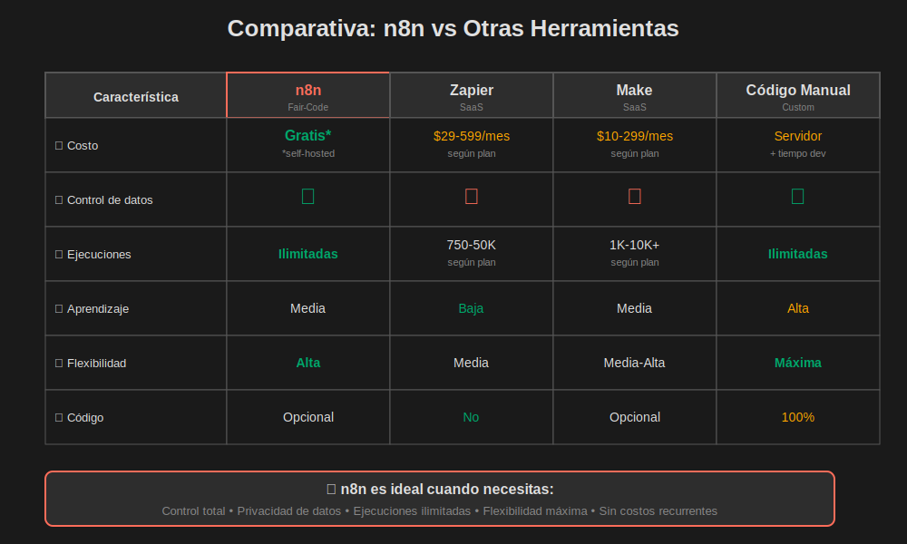

# ¿Qué es n8n y por qué usarlo?

## 📋 Introducción

**n8n** (n-eight-n) es una plataforma de automatización de workflows de código abierto y "fair-code" que permite conectar diferentes aplicaciones y servicios entre sí sin necesidad de escribir código complejo.

El nombre "n8n" hace referencia a "nodemation" (node + automation), representando el concepto de automatización basada en nodos.

## 🎯 Conceptos Fundamentales

### ¿Qué es una Automatización de Workflow?

Una automatización de workflow es una secuencia de tareas que se ejecutan automáticamente cuando ocurre un evento específico, sin necesidad de intervención manual.

**Ejemplo del mundo real:**
Imagina que cada vez que llega un email importante a tu bandeja de entrada, quieres que automáticamente:

1. Se guarde en Google Drive
2. Se cree una tarea en tu gestor de proyectos
3. Se envíe una notificación a Slack

En lugar de hacer estos 3 pasos manualmente cada vez, n8n puede hacerlo por ti en segundos.


> **💡 Visualización clave:** El diagrama anterior muestra el flujo completo de un workflow en n8n: desde un evento disparador (trigger), pasando por nodos de procesamiento, hasta las acciones finales. Este es el patrón fundamental que aprenderás a dominar.

### ¿Qué es un Nodo?

Un **nodo** es un bloque de construcción que realiza una acción específica dentro de un workflow. Cada nodo tiene:

- **Entrada:** Datos que recibe del nodo anterior
- **Procesamiento:** Acción que realiza (llamar API, transformar datos, etc.)
- **Salida:** Datos que envía al siguiente nodo

**Analogía:**
Piensa en los nodos como estaciones en una línea de ensamblaje de una fábrica. Cada estación (nodo) recibe un producto, hace algo con él, y lo pasa a la siguiente estación.

## 🌟 Características Principales de n8n

### 1. **Open Source (Código Abierto)**

n8n es software libre bajo licencia "fair-code", lo que significa:

✅ **Ventajas:**

- Puedes ver y auditar el código fuente
- Comunidad activa que contribuye con mejoras
- No hay sorpresas en términos de privacidad
- Puedes extenderlo según tus necesidades

❌ **Diferencia con otros:**

- Zapier: Código cerrado, no puedes ver cómo funciona
- Make (Integromat): Similar, código propietario
- Power Automate: Ecosistema cerrado de Microsoft

### 2. **Self-Hosted (Auto-Hospedado)**

Puedes instalar n8n en tu propio servidor o computadora:

✅ **Ventajas:**

- **Control total** sobre tus datos
- **Privacidad garantizada** - los datos nunca salen de tu infraestructura
- **Sin límites** de ejecuciones (en instalación local)
- **Personalización completa** del entorno

**Comparación:**

| Característica        | n8n Self-Hosted        | Zapier               | Make                 |
| --------------------- | ---------------------- | -------------------- | -------------------- |
| Control de datos      | ✅ Total               | ❌ En sus servidores | ❌ En sus servidores |
| Límite de ejecuciones | ✅ Ilimitado           | ❌ Por plan          | ❌ Por plan          |
| Costo mensual         | ✅ $0 (hosting aparte) | 💰 $19.99+           | 💰 $9+               |
| Personalización       | ✅ Total               | ❌ Limitada          | ❌ Limitada          |

### 3. **Fair-Code Licensed**

n8n usa una licencia "fair-code" que:

- ✅ Es **gratis para uso personal**
- ✅ Es **gratis para uso interno en empresas**
- ⚠️ Requiere licencia si vendes n8n como servicio (SaaS)

**En la práctica para este bootcamp:**
Como estudiante o empresa que usa n8n internamente, es **completamente gratuito**.

### 4. **Interfaz Visual (Low-Code/No-Code)**

n8n tiene una interfaz gráfica intuitiva donde:

- 🖱️ Arrastras y sueltas nodos
- 🔗 Conectas nodos con líneas
- 👁️ Ves el flujo de datos en tiempo real
- ⚙️ Configuras cada nodo con formularios simples

**No necesitas ser programador**, aunque si lo eres, puedes aprovechar nodos de código para mayor flexibilidad.

### 5. **Más de 350+ Integraciones**

n8n se conecta con cientos de aplicaciones populares:

**Productividad:**

- Google Workspace (Gmail, Drive, Sheets, Calendar)
- Microsoft 365 (Outlook, OneDrive, Teams)
- Notion, Airtable, Asana, Trello

**Comunicación:**

- Slack, Discord, Telegram, WhatsApp
- Email (SMTP, IMAP)

**Desarrollo:**

- GitHub, GitLab, Bitbucket
- Jira, Linear

**Marketing:**

- Mailchimp, SendGrid
- HubSpot, Salesforce

**Bases de datos:**

- PostgreSQL, MySQL, MongoDB
- Redis, Supabase

**APIs Genéricas:**

- HTTP Request (cualquier API REST)
- Webhooks
- GraphQL

## 💡 ¿Por Qué Usar n8n?

### Razón 1: Ahorro de Tiempo

**Escenario real:**
Eres un desarrollador que recibe notificaciones de errores por email. Manualmente:

1. Revisas el email (2 min)
2. Creas un issue en GitHub (3 min)
3. Notificas al equipo en Slack (1 min)
   **Total:** 6 minutos por error × 10 errores/día = **1 hora diaria**

**Con n8n:**
El workflow se ejecuta automáticamente en **2 segundos**. Ahorras **~20 horas al mes**.

### Razón 2: Reducción de Errores Humanos

Los humanos cometen errores al hacer tareas repetitivas:

- ❌ Olvidar copiar datos
- ❌ Formatear incorrectamente
- ❌ Enviar a la persona equivocada

**n8n es consistente:** Si funciona una vez, funcionará siempre igual.

### Razón 3: Escalabilidad

**Sin automatización:**

- 1 cliente = 5 minutos de trabajo manual
- 100 clientes = 8+ horas de trabajo

**Con n8n:**

- 1 cliente = workflow automático
- 1000 clientes = mismo workflow automático
- **Escala sin esfuerzo adicional**

### Razón 4: Costo-Beneficio

**Alternativas comerciales:**

```
Zapier Professional: $49/mes (2,000 tareas)
Make Pro: $16/mes (10,000 operaciones)
n8n Cloud: $20/mes (ilimitado)
n8n Self-Hosted: $0/mes (ilimitado) ✅
```

**ROI (Retorno de Inversión):**
Si ahorras 10 horas/mes a $30/hora = **$300 de valor generado**

### Razón 5: Flexibilidad y Control

Con n8n puedes:

- ✅ Crear integraciones personalizadas
- ✅ Usar JavaScript cuando lo necesites
- ✅ Conectar sistemas legacy propios
- ✅ Mantener datos sensibles en tu infraestructura

## 🎓 Casos de Uso Comunes

### 1. Automatización de Marketing

**Workflow:** "Nuevo suscriptor en Mailchimp"

```
Trigger: Nuevo contacto en Mailchimp
→ Agregar a Google Sheets (base de datos)
→ Crear contacto en CRM
→ Enviar mensaje de bienvenida personalizado
→ Notificar al equipo de ventas en Slack
```

**Impacto:**

- ⏱️ Ahorra 5 minutos por suscriptor
- 📈 100% de consistencia en seguimiento
- 💰 Aumento de conversión por respuesta rápida

### 2. Monitoreo y Alertas

**Workflow:** "Detector de errores de servidor"

```
Trigger: Cada 5 minutos
→ Hacer ping a API del servidor
→ IF: Respuesta error o timeout
   → Crear issue en GitHub
   → Enviar SMS de alerta (Twilio)
   → Notificar canal #emergencias en Slack
```

**Impacto:**

- 🚨 Detección en < 5 minutos
- 📱 Alertas multi-canal
- 📊 Historial automático de incidentes

### 3. Sincronización de Datos

**Workflow:** "Sincronizar ventas entre plataformas"

```
Trigger: Nueva venta en Shopify
→ Crear registro en Google Sheets
→ Actualizar inventario en base de datos propia
→ Generar factura PDF
→ Enviar email al cliente
→ Actualizar dashboard de Analytics
```

**Impacto:**

- 🔄 Sincronización en tiempo real
- 📦 Control de inventario automático
- 📧 Comunicación instantánea

---


> **💡 Aplicabilidad universal:** Como muestra el diagrama, n8n se adapta a múltiples industrias y departamentos. Los workflows siguen el mismo patrón fundamental, solo cambian las herramientas y datos específicos de cada contexto.

---

### 4. Onboarding de Empleados

- 🔄 Datos siempre sincronizados
- 📊 Visibilidad en tiempo real
- 🤝 Sin silos de información

### 4. Onboarding de Empleados

**Workflow:** "Nuevo empleado en RRHH"

```
Trigger: Formulario de nuevo empleado (Typeform)
→ Crear usuario en Google Workspace
→ Agregar a grupos de Slack relevantes
→ Crear cuenta en GitHub/GitLab
→ Enviar checklist de bienvenida por email
→ Agendar reunión 1-on-1 en Calendar
→ Notificar a manager
```

**Impacto:**

- ⚡ Setup completo en < 5 minutos
- ✅ Cero pasos olvidados
- 😊 Mejor experiencia de nuevo empleado

### 5. Generación de Reportes

**Workflow:** "Reporte semanal automatizado"

```
Trigger: Cada lunes a las 9 AM
→ Obtener métricas de Google Analytics
→ Obtener datos de ventas de base de datos
→ Obtener tickets de soporte (Zendesk)
→ Generar gráficos con datos
→ Crear documento PDF con reporte
→ Enviar por email a stakeholders
→ Guardar en Google Drive
```

**Impacto:**

- 📅 Puntualidad perfecta
- 📊 Datos siempre actualizados
- ⏱️ Ahorra 2+ horas semanales

## 🔄 Ciclo de Vida de un Workflow en n8n

```
1. TRIGGER (Inicio)
   ↓
2. PROCESAMIENTO
   ↓
3. TRANSFORMACIÓN
   ↓
4. ACCIÓN
   ↓
5. RESULTADO
```

**Ejemplo concreto:**

```
1. TRIGGER: Nuevo email recibido
   ↓
2. PROCESAMIENTO: Extraer datos del email (remitente, asunto, adjuntos)
   ↓
3. TRANSFORMACIÓN: Formatear datos para API
   ↓
4. ACCIÓN: Crear ticket en sistema de soporte
   ↓
5. RESULTADO: Enviar confirmación al cliente
```

## 🆚 n8n vs Alternativas



> **💡 Decisión estratégica:** La tabla comparativa te ayuda a entender cuándo elegir n8n sobre otras opciones. n8n brilla cuando necesitas control total, privacidad de datos y ejecuciones ilimitadas sin costos recurrentes.

### n8n vs Zapier

| Aspecto                  | n8n                    | Zapier            |
| ------------------------ | ---------------------- | ----------------- |
| **Precio**               | Gratis (self-hosted)   | $19.99+/mes       |
| **Límites**              | Ilimitado              | Por plan          |
| **Privacidad**           | Datos en tu servidor   | Datos en su cloud |
| **Personalización**      | Total (código abierto) | Limitada          |
| **Curva de aprendizaje** | Media                  | Fácil             |
| **Integraciones**        | 350+                   | 5000+             |

**¿Cuándo elegir n8n?**

- ✅ Necesitas privacidad de datos
- ✅ Quieres control total
- ✅ Budget limitado
- ✅ Workflows complejos con lógica custom

**¿Cuándo elegir Zapier?**

- ✅ Necesitas empezar en 5 minutos
- ✅ Integraciones muy específicas
- ✅ No quieres gestionar servidores

### n8n vs Make (Integromat)

| Aspecto               | n8n              | Make             |
| --------------------- | ---------------- | ---------------- |
| **Modelo de negocio** | Fair-code        | Comercial        |
| **Self-hosting**      | ✅ Sí            | ❌ No            |
| **Interfaz visual**   | Basada en nodos  | Basada en flujos |
| **Precio**            | $0 (self-hosted) | $9+/mes          |
| **Flexibilidad**      | Alta (código JS) | Media            |

### n8n vs Scripting Manual (Python, etc.)

| Aspecto                  | n8n             | Python Script         |
| ------------------------ | --------------- | --------------------- |
| **Tiempo de desarrollo** | Rápido (visual) | Lento (código)        |
| **Mantenimiento**        | Fácil           | Requiere programador  |
| **Documentación visual** | Automática      | Manual                |
| **Monitoreo**            | Built-in        | Necesitas implementar |
| **Flexibilidad**         | Alta            | Máxima                |

**¿Cuándo usar n8n?**

- ✅ Integraciones estándar (APIs existentes)
- ✅ Necesitas GUI para no-programadores
- ✅ Quieres debugging visual

**¿Cuándo usar código?**

- ✅ Lógica extremadamente compleja
- ✅ Performance crítica
- ✅ Algoritmos propietarios

## 🎯 ¿Para Quién es n8n?

### ✅ Ideal para:

**1. Equipos de Operaciones (Ops)**

- Automatizar tareas repetitivas
- Sincronizar herramientas del stack

**2. Desarrolladores**

- Prototipado rápido de integraciones
- Automatización de DevOps
- Webhooks y APIs

**3. Pequeñas Empresas / Startups**

- Budget limitado
- Necesidad de integrar muchas herramientas
- Escalabilidad sin costos adicionales

**4. Equipos de Marketing**

- Lead nurturing automatizado
- Sincronización de campañas
- Reportes automatizados

**5. Freelancers / Agencias**

- Automatizar procesos de clientes
- Cobrar por valor agregado (no horas)
- Workflows reutilizables

### ⚠️ Menos ideal para:

**1. Organizaciones sin recursos técnicos**

- Requiere setup inicial
- Mantenimiento de servidor (si self-hosted)

**2. Necesidades extremadamente simples**

- Si solo necesitas 1-2 automatizaciones muy básicas
- Zapier podría ser más rápido

**3. Integraciones muy específicas no soportadas**

- Si la app que necesitas no tiene integración
- Aunque puedes usar HTTP Request para cualquier API

## 🚀 Siguientes Pasos

Ahora que entiendes **qué es n8n** y **por qué usarlo**, en los siguientes módulos aprenderás:

1. **Casos de uso empresariales** - Ejemplos reales de industrias
2. **Arquitectura básica** - Cómo funciona n8n internamente
3. **Instalación y configuración** - Hands-on setup
4. **Tu primer workflow** - Crear una automatización simple

## 📚 Recursos Adicionales

- [Sitio oficial de n8n](https://n8n.io)
- [Documentación oficial](https://docs.n8n.io)
- [Galería de workflows](https://n8n.io/workflows)
- [Comunidad en Discord](https://discord.gg/n8n)
- [Blog de n8n](https://blog.n8n.io)

## 💭 Preguntas de Reflexión

Antes de continuar, reflexiona:

1. ¿Qué tareas repetitivas haces en tu trabajo que podrías automatizar?
2. ¿Qué herramientas usas que necesitan estar conectadas?
3. ¿Cuánto tiempo estimás que ahorrarías con automatización?
4. ¿Prefieres n8n Cloud o self-hosted? ¿Por qué?

---

**🎓 Lección completada.** En la próxima lección veremos **casos de uso empresariales específicos** por industria.
