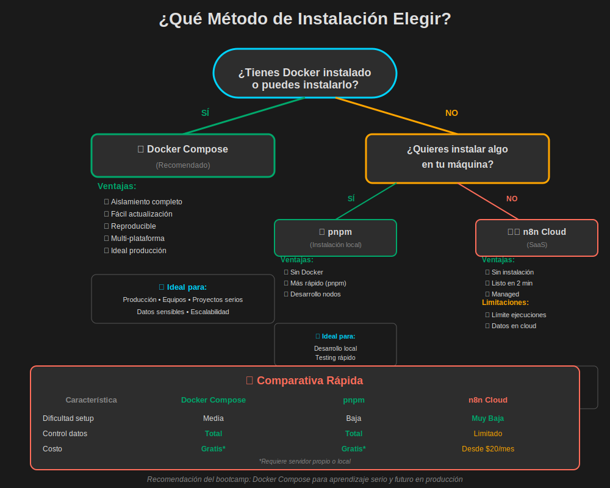

# Instalación y Configuración de n8n

## 🎯 Objetivos de Aprendizaje

Al completar este documento, serás capaz de:

1. **Instalar** n8n usando diferentes métodos (Docker Compose, pnpm, n8n Cloud)
2. **Configurar** el entorno de desarrollo local adecuadamente
3. **Acceder** a la interfaz de n8n y navegar por sus secciones principales
4. **Gestionar** variables de entorno y configuraciones básicas
5. **Solucionar** problemas comunes de instalación
6. **Decidir** qué método de instalación es mejor para tu caso de uso

**⏱️ Tiempo estimado:** 30-40 minutos (incluye instalación)  
**📚 Nivel:** Principiante  
**💻 Prerrequisitos:**

- Sistema operativo: Linux, macOS o Windows
- Docker instalado (para método recomendado)
- 4GB RAM mínimo, 8GB recomendado
- Conexión a internet estable

---

## 📋 Introducción

La instalación correcta de n8n es el primer paso crítico para comenzar a crear automatizaciones. En este documento, exploraremos **tres métodos principales** de instalación, con énfasis en Docker Compose como la opción más robusta y reproducible.

### ¿Por qué es importante elegir bien el método de instalación?

- **Consistencia:** Mismo entorno en desarrollo y producción
- **Aislamiento:** No afecta otras aplicaciones en tu sistema
- **Portabilidad:** Fácil de mover entre servidores
- **Mantenimiento:** Actualizaciones y rollbacks simples



> **💡 Guía de decisión:** El diagrama anterior te ayuda a elegir el método más adecuado según tus necesidades y recursos disponibles. Para este bootcamp, recomendamos Docker Compose ya que simula mejor un entorno de producción real.

---

## 🐳 Método 1: Docker Compose (Recomendado)

### ¿Por qué Docker Compose?

✅ **Ventajas:**

- Instalación consistente en todos los sistemas operativos
- Aislamiento completo del entorno
- Fácil gestión de volúmenes y persistencia de datos
- Configuración reproducible con archivo `docker-compose.yml`
- No requiere instalar Node.js globalmente
- Ideal para desarrollo y producción

✅ **Por qué Alpine Linux:**

- Imágenes más ligeras (menor tamaño de descarga)
- Menor superficie de ataque (más seguro)
- Inicio más rápido de contenedores
- Optimización de recursos

### Prerrequisitos

```bash
# Verificar que Docker esté instalado
docker --version
# Salida esperada: Docker version 24.x.x o superior

# Verificar que Docker Compose esté instalado
docker compose version
# Salida esperada: Docker Compose version v2.x.x o superior
```

### Paso 1: Crear Estructura de Directorios

```bash
# Crear directorio para el proyecto
mkdir -p ~/n8n-bootcamp
cd ~/n8n-bootcamp

# Crear subdirectorios para organización
mkdir -p workflows credentials backups
```

**Estructura resultante:**

```
n8n-bootcamp/
├── docker-compose.yml    # Configuración de servicios
├── .env                  # Variables de entorno (crear después)
├── workflows/            # Workflows exportados
├── credentials/          # Respaldo de credenciales (cuidado con seguridad)
└── backups/             # Backups automáticos
```


> **💡 Organización clave:** La estructura de directorios mostrada separa claramente archivos de configuración, workflows versionables en Git, y datos sensibles que deben mantenerse fuera del control de versiones. El volumen Docker interno persiste la base de datos y configuración crítica.

### Paso 2: Crear archivo `docker-compose.yml`

Crea el archivo con el siguiente contenido:

```yaml
services:
  n8n:
    image: n8nio/n8n:latest
    container_name: n8n-bootcamp
    restart: unless-stopped
    ports:
      - '5678:5678'
    environment:
      # Configuración básica
      - N8N_HOST=localhost
      - N8N_PORT=5678
      - N8N_PROTOCOL=http
      - NODE_ENV=production

      # Webhook URL (importante para triggers)
      - WEBHOOK_URL=http://localhost:5678/

      # Zona horaria (ajustar según tu ubicación)
      - GENERIC_TIMEZONE=America/Mexico_City
      - TZ=America/Mexico_City

      # Configuración de ejecuciones
      - EXECUTIONS_DATA_SAVE_ON_ERROR=all
      - EXECUTIONS_DATA_SAVE_ON_SUCCESS=all
      - EXECUTIONS_DATA_SAVE_MANUAL_EXECUTIONS=true

      # Seguridad básica
      - N8N_BASIC_AUTH_ACTIVE=true
      - N8N_BASIC_AUTH_USER=admin
      - N8N_BASIC_AUTH_PASSWORD=bootcamp2024

    volumes:
      # Persistencia de datos
      - n8n_data:/home/node/.n8n

      # Opcional: mapear workflows localmente para versionado
      - ./workflows:/home/node/.n8n/workflows

      # Opcional: mapear credenciales (¡cuidado con seguridad!)
      # - ./credentials:/home/node/.n8n/credentials

    healthcheck:
      test: ['CMD', 'wget', '--spider', '-q', 'http://localhost:5678/healthz']
      interval: 30s
      timeout: 10s
      retries: 3
      start_period: 40s

volumes:
  n8n_data:
    name: n8n_bootcamp_data
```

### Paso 3: Iniciar n8n

```bash
# Iniciar en modo detached (segundo plano)
docker compose up -d

# Salida esperada:
# [+] Running 2/2
#  ✔ Volume "n8n_bootcamp_data"  Created
#  ✔ Container n8n-bootcamp      Started
```

### Paso 4: Verificar que n8n esté funcionando

```bash
# Ver logs en tiempo real
docker compose logs -f n8n

# Espera ver algo como:
# n8n-bootcamp  | n8n ready on 0.0.0.0, port 5678
# n8n-bootcamp  | Version: 1.x.x
```

**Acceder a la interfaz:**

1. Abre tu navegador
2. Ve a: `http://localhost:5678`
3. Inicia sesión con:
   - Usuario: `admin`
   - Contraseña: `bootcamp2024`

### Comandos Útiles de Docker Compose

```bash
# Ver estado de contenedores
docker compose ps

# Detener n8n (sin eliminar datos)
docker compose stop

# Iniciar n8n nuevamente
docker compose start

# Reiniciar n8n
docker compose restart

# Detener y eliminar contenedores (datos persisten en volumen)
docker compose down

# Ver logs de los últimos 100 líneas
docker compose logs --tail=100 n8n

# Actualizar n8n a la última versión
docker compose pull
docker compose up -d

# Acceder al shell del contenedor (troubleshooting)
docker compose exec n8n sh
```

### Configuración Avanzada (Opcional)

#### Archivo `.env` para Variables de Entorno

Crea un archivo `.env` en el mismo directorio:

```env
# .env
N8N_BASIC_AUTH_USER=tu_usuario
N8N_BASIC_AUTH_PASSWORD=tu_contraseña_segura
GENERIC_TIMEZONE=America/Mexico_City
```

Luego modifica `docker-compose.yml`:

```yaml
services:
  n8n:
    # ... resto de configuración
    env_file:
      - .env
    environment:
      # Solo las variables que no estén en .env
      - N8N_HOST=localhost
      # ...
```

⚠️ **Seguridad:** Agrega `.env` a tu `.gitignore` para no exponer credenciales.

---

## 📦 Método 2: Instalación con pnpm (Alternativa)

### ¿Cuándo usar pnpm?

- No puedes usar Docker
- Necesitas desarrollo local de nodos custom
- Prefieres instalación nativa en tu sistema

### ¿Por qué pnpm sobre npm?

✅ **Ventajas de pnpm:**

- **Más rápido:** Hasta 2x más rápido que npm
- **Ahorro de espacio:** Almacenamiento compartido entre proyectos
- **Gestión eficiente:** Mejor resolución de dependencias
- **Monorepo-friendly:** Ideal si trabajas con múltiples proyectos

### Paso 1: Instalar pnpm

```bash
# Método 1: Con npm (si ya lo tienes)
npm install -g pnpm

# Método 2: Script de instalación (Linux/macOS)
curl -fsSL https://get.pnpm.io/install.sh | sh -

# Método 3: Con Homebrew (macOS)
brew install pnpm

# Verificar instalación
pnpm --version
# Salida esperada: 8.x.x o superior
```

### Paso 2: Instalar n8n globalmente

```bash
# Instalar n8n con pnpm
pnpm install -g n8n

# Esto puede tomar unos minutos...
# Verás el progreso de instalación de dependencias
```

### Paso 3: Iniciar n8n

```bash
# Iniciar n8n
n8n start

# Salida esperada:
# n8n ready on localhost, port 5678
# Version: 1.x.x
```

**Acceder a la interfaz:**

- Abre tu navegador en: `http://localhost:5678`

### Configuración con Variables de Entorno (pnpm)

```bash
# Linux/macOS: Agregar a ~/.bashrc o ~/.zshrc
export N8N_BASIC_AUTH_ACTIVE=true
export N8N_BASIC_AUTH_USER=admin
export N8N_BASIC_AUTH_PASSWORD=bootcamp2024
export GENERIC_TIMEZONE=America/Mexico_City

# Recargar configuración
source ~/.zshrc  # o ~/.bashrc

# Iniciar n8n con variables aplicadas
n8n start
```

### Comandos Útiles (pnpm)

```bash
# Actualizar n8n
pnpm update -g n8n

# Desinstalar n8n
pnpm uninstall -g n8n

# Ver versión instalada
n8n --version

# Iniciar en modo desarrollo (más logs)
n8n start --tunnel
```

---

## ☁️ Método 3: n8n Cloud (Inicio Rápido)

### ¿Cuándo usar n8n Cloud?

✅ **Ideal para:**

- Probar n8n sin instalación local
- Proyectos pequeños sin datos sensibles
- Equipos distribuidos
- No quieres gestionar infraestructura

❌ **No recomendado para:**

- Datos altamente sensibles (financieros, salud, etc.)
- Ejecuciones ilimitadas (hay límites por plan)
- Integraciones con sistemas internos (detrás de firewall)

### Pasos para Empezar

1. **Registrarse:**

   - Ve a: https://n8n.cloud
   - Crea cuenta con email o Google/GitHub
   - Plan gratuito disponible (5,000 ejecuciones/mes)

2. **Crear tu primer workflow:**

   - Desde el dashboard, haz clic en "New Workflow"
   - Interfaz idéntica a versión self-hosted

3. **Configurar credenciales:**
   - Más seguro: n8n Cloud gestiona el almacenamiento
   - Pero: Tus credenciales están en servidores de n8n

### Planes de n8n Cloud

| Plan           | Ejecuciones/mes | Precio  | Ideal para           |
| -------------- | --------------- | ------- | -------------------- |
| **Starter**    | 5,000           | Gratis  | Aprendizaje, pruebas |
| **Pro**        | 50,000          | $20/mes | Equipos pequeños     |
| **Enterprise** | Ilimitadas      | Custom  | Empresas grandes     |

---

## 🔧 Configuración Post-Instalación

### 1. Primer Acceso a la Interfaz

Al acceder por primera vez a `http://localhost:5678`:

1. **Pantalla de bienvenida:**

   - Te pedirá crear cuenta o continuar sin registro
   - Para uso local, puedes saltear el registro

2. **Tour guiado:**

   - n8n ofrece un tour interactivo
   - Recomendado: completarlo (5 minutos)

3. **Dashboard principal:**
   - Verás la lista de workflows (vacía al inicio)
   - Barra lateral con secciones: Workflows, Credentials, Executions

### 2. Configurar Credenciales de Ejemplo

Para probar integraciones, vamos a configurar una credencial simple:

**Ejemplo: Credencial HTTP Header Auth**

1. Click en **Credentials** (barra lateral)
2. Click en **Add Credential**
3. Buscar "Header Auth"
4. Configurar:
   ```
   Name: API Test
   Header Name: Authorization
   Header Value: Bearer tu_token_aqui
   ```
5. Click en **Save**

### 3. Variables de Entorno Importantes

| Variable                          | Descripción                   | Valor por Defecto  | Ejemplo                       |
| --------------------------------- | ----------------------------- | ------------------ | ----------------------------- |
| `N8N_HOST`                        | Hostname donde n8n escucha    | `localhost`        | `0.0.0.0` para acceso externo |
| `N8N_PORT`                        | Puerto de la aplicación       | `5678`             | `8080`                        |
| `N8N_PROTOCOL`                    | Protocolo (http/https)        | `http`             | `https` para producción       |
| `WEBHOOK_URL`                     | URL base para webhooks        | -                  | `https://tu-dominio.com/`     |
| `GENERIC_TIMEZONE`                | Zona horaria                  | `America/New_York` | `America/Mexico_City`         |
| `N8N_BASIC_AUTH_ACTIVE`           | Activar autenticación         | `false`            | `true`                        |
| `EXECUTIONS_DATA_SAVE_ON_ERROR`   | Guardar ejecuciones con error | `all`              | `all`, `none`                 |
| `EXECUTIONS_DATA_SAVE_ON_SUCCESS` | Guardar ejecuciones exitosas  | `all`              | `all`, `none`                 |
| `N8N_LOG_LEVEL`                   | Nivel de logs                 | `info`             | `debug`, `error`              |

**Para Docker:** Agregar en sección `environment` del `docker-compose.yml`  
**Para pnpm:** Exportar antes de `n8n start`

---

## 🌐 Navegación por la Interfaz de n8n

### Estructura Principal

```
┌─────────────────────────────────────────────────────┐
│  [Logo n8n]  Workflows  Credentials  Executions    │  ← Barra Superior
├─────────────────────────────────────────────────────┤
│                                                     │
│  [+] New Workflow                                   │
│                                                     │
│  📋 My Workflows                                    │
│     ├── Marketing Automation (3 nodos)              │
│     ├── Data Sync (5 nodos)                         │
│     └── Email Processor (8 nodos)                   │
│                                                     │
│  🔄 Active (2)                                      │
│  ⏸️  Inactive (1)                                    │
│                                                     │
└─────────────────────────────────────────────────────┘
```

### Secciones Clave

#### 1. **Workflows**

- Lista de todos tus workflows
- Filtros: Activos, Inactivos, Míos, Compartidos
- Búsqueda por nombre
- Opciones: Editar, Duplicar, Eliminar, Exportar

#### 2. **Credentials**

- Gestión centralizada de credenciales
- Tipos: OAuth2, API Key, Basic Auth, etc.
- Compartir entre workflows
- **Importante:** Nunca expongas credenciales en workflows exportados

#### 3. **Executions**

- Historial de todas las ejecuciones
- Ver entrada/salida de cada nodo
- Debugging y troubleshooting
- Filtros por estado: Success, Error, Running, Waiting

#### 4. **Settings** (⚙️)

- Configuración de n8n
- API Keys (para acceso programático)
- Webhooks test URL
- Configuración de comunidad

---

## 🛠️ Solución de Problemas Comunes

### Problema 1: Puerto 5678 ya está en uso

**Síntoma:**

```bash
Error: listen EADDRINUSE: address already in use :::5678
```

**Solución Docker:**

```yaml
# Cambiar el puerto en docker-compose.yml
ports:
  - '8080:5678' # Mapear puerto 8080 externo a 5678 interno
```

**Solución pnpm:**

```bash
# Iniciar en otro puerto
export N8N_PORT=8080
n8n start
```

### Problema 2: Contenedor no inicia (Docker)

**Diagnóstico:**

```bash
# Ver logs detallados
docker compose logs n8n

# Ver estado del contenedor
docker compose ps
```

**Soluciones comunes:**

- Verificar que Docker esté corriendo: `docker info`
- Verificar sintaxis del `docker-compose.yml`: `docker compose config`
- Reiniciar Docker: `sudo systemctl restart docker` (Linux)

### Problema 3: No se guardan los workflows

**Causa:** Problema de permisos en volúmenes

**Solución:**

```bash
# Verificar volúmenes
docker volume ls

# Inspeccionar volumen
docker volume inspect n8n_bootcamp_data

# Si hay problemas, recrear volumen
docker compose down -v
docker compose up -d
```

### Problema 4: Credenciales no se guardan (pnpm)

**Causa:** Directorio de configuración no tiene permisos

**Solución Linux/macOS:**

```bash
# Verificar directorio de n8n
ls -la ~/.n8n

# Dar permisos correctos
chmod 700 ~/.n8n
chmod 600 ~/.n8n/credentials.json
```

### Problema 5: Webhooks no funcionan

**Causa:** `WEBHOOK_URL` no configurado correctamente

**Solución:**

```yaml
# En docker-compose.yml
environment:
  - WEBHOOK_URL=http://localhost:5678/
# O si usas ngrok/túnel:
# - WEBHOOK_URL=https://tu-subdominio.ngrok.io/
```

### Problema 6: n8n muy lento

**Diagnóstico:**

```bash
# Ver uso de recursos del contenedor
docker stats n8n-bootcamp
```

**Soluciones:**

- Aumentar memoria asignada a Docker (mínimo 2GB)
- Limpiar ejecuciones antiguas: Settings → Executions → Prune
- Verificar disco duro no esté lleno

---

## 📊 Verificación de Instalación Exitosa

### Checklist Post-Instalación

- [ ] n8n accesible en `http://localhost:5678`
- [ ] Puedes iniciar sesión (si configuraste auth)
- [ ] Dashboard muestra interfaz completa
- [ ] Puedes crear un workflow nuevo
- [ ] Puedes agregar nodos al canvas
- [ ] Puedes guardar el workflow
- [ ] Puedes ejecutar un workflow simple
- [ ] Logs muestran ejecución exitosa

### Workflow de Prueba Simple

Crea este workflow para verificar que todo funcione:

```
Manual Trigger → Set Node → Show Message
```

**Pasos:**

1. Crear nuevo workflow
2. Agregar nodo "Manual Trigger"
3. Conectar nodo "Set"
   - Configurar: `message = "Hello n8n!"`
4. Conectar nodo "Stop and Error" o simplemente ver output
5. Click en "Execute Workflow"
6. Verificar que veas el mensaje en el output

✅ **Si ves el mensaje, ¡tu instalación funciona correctamente!**

---

## 🔐 Mejores Prácticas de Seguridad

### 1. Autenticación Básica

**Siempre activa autenticación en producción:**

```yaml
environment:
  - N8N_BASIC_AUTH_ACTIVE=true
  - N8N_BASIC_AUTH_USER=${N8N_USER}
  - N8N_BASIC_AUTH_PASSWORD=${N8N_PASSWORD}
```

### 2. HTTPS en Producción

**Nunca uses HTTP en producción:**

```yaml
environment:
  - N8N_PROTOCOL=https
  - N8N_SSL_KEY=/path/to/ssl/key.pem
  - N8N_SSL_CERT=/path/to/ssl/cert.pem
```

**O usa reverse proxy (Nginx, Traefik, Caddy)** - Recomendado

### 3. Firewall

**Restringe acceso al puerto 5678:**

```bash
# UFW (Ubuntu/Debian)
sudo ufw allow from 192.168.1.0/24 to any port 5678

# iptables
sudo iptables -A INPUT -p tcp -s 192.168.1.0/24 --dport 5678 -j ACCEPT
sudo iptables -A INPUT -p tcp --dport 5678 -j DROP
```

### 4. Credenciales

- ✅ **Sí:** Usar variables de entorno
- ✅ **Sí:** Rotar credenciales regularmente
- ❌ **No:** Hardcodear credenciales en workflows
- ❌ **No:** Compartir workflows con credenciales embebidas
- ❌ **No:** Subir archivo `.env` a Git

### 5. Backups

**Automatiza backups del volumen de datos:**

```bash
# Script de backup simple
#!/bin/bash
DATE=$(date +%Y%m%d_%H%M%S)
docker run --rm \
  -v n8n_bootcamp_data:/data \
  -v $(pwd)/backups:/backup \
  alpine tar czf /backup/n8n-backup-$DATE.tar.gz /data

# Mantener solo últimos 7 backups
find ./backups -name "n8n-backup-*.tar.gz" -mtime +7 -delete
```

---

## 📚 Recursos Adicionales

### Documentación Oficial

- **Docs de instalación:** https://docs.n8n.io/hosting/
- **Docker setup:** https://docs.n8n.io/hosting/installation/docker/
- **Variables de entorno:** https://docs.n8n.io/hosting/configuration/environment-variables/

### Comunidad

- **Forum oficial:** https://community.n8n.io/
- **Discord:** Enlace en sitio oficial
- **GitHub Issues:** https://github.com/n8n-io/n8n/issues

### Tutoriales Recomendados

- Video oficial: "Getting Started with n8n"
- Blog n8n: Artículos de casos de uso
- YouTube: Canal oficial de n8n

---

## ✅ Resumen y Próximos Pasos

### Lo que Aprendiste

En este documento cubrimos:

✅ **Tres métodos de instalación:**

- Docker Compose (recomendado para producción)
- pnpm (para desarrollo nativo)
- n8n Cloud (para pruebas rápidas)

✅ **Configuración post-instalación:**

- Variables de entorno críticas
- Autenticación básica
- Estructura de directorios

✅ **Navegación por la interfaz:**

- Secciones principales
- Gestión de workflows y credenciales

✅ **Troubleshooting:**

- Problemas comunes y sus soluciones
- Verificación de instalación correcta

✅ **Seguridad:**

- Mejores prácticas
- Protección de credenciales
- Backups automáticos

### Siguiente Paso

📖 **Próximo documento:** [03-interfaz-navegacion.md](./03-interfaz-navegacion.md)

En el siguiente módulo aprenderás:

- Anatomía detallada de un workflow
- Cómo agregar y configurar nodos
- Conexiones y flujo de datos
- Primeros workflows prácticos

---

## 🤔 Preguntas de Reflexión

Antes de continuar, reflexiona sobre estas preguntas:

1. **¿Qué método de instalación elegiste y por qué?**

   - ¿Es el más adecuado para tu caso de uso?

2. **¿Configuraste autenticación básica?**

   - Si no, ¿por qué no? (Recuerda: es crítico en producción)

3. **¿Pudiste acceder a la interfaz correctamente?**

   - Si hubo problemas, ¿consultaste la sección de troubleshooting?

4. **¿Hiciste el workflow de prueba?**

   - Si funcionó, ¡estás listo para el siguiente paso!

5. **¿Entiendes la diferencia entre n8n self-hosted y n8n Cloud?**
   - ¿Cuál es mejor para datos sensibles?

---

## 📝 Ejercicio Práctico

**Desafío:** Instala n8n con Docker Compose y crea tu primer workflow que:

1. Use "Manual Trigger" como inicio
2. Agregue un nodo "Set" con tu nombre
3. Agregue un nodo "HTTP Request" que haga GET a: `https://api.github.com/users/n8n-io`
4. Vea el resultado en el output

**Tiempo estimado:** 15 minutos

**Validación:**

- ✅ El workflow se ejecuta sin errores
- ✅ Ves información del usuario GitHub de n8n
- ✅ Puedes guardar y nombrar el workflow

---

**🎉 ¡Felicidades!** Has completado la instalación y configuración de n8n. Ahora tienes un entorno funcional para comenzar a crear automatizaciones poderosas.

**Siguiente:** [03-interfaz-navegacion.md](./03-interfaz-navegacion.md) →
