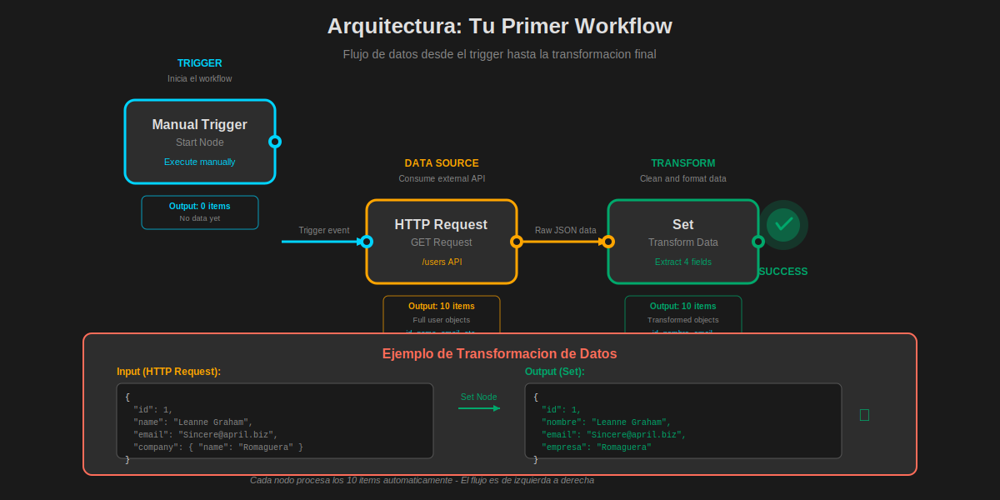

# Tu Primer Workflow en n8n

## 📋 Objetivos de Aprendizaje

Al finalizar este documento, serás capaz de:

- ✅ Crear tu primer workflow funcional en n8n desde cero
- ✅ Entender el flujo de datos entre nodos
- ✅ Configurar un trigger manual para iniciar workflows
- ✅ Usar el nodo HTTP Request para consumir APIs
- ✅ Transformar datos con el nodo Set
- ✅ Ejecutar y depurar workflows paso a paso
- ✅ Interpretar los resultados de cada nodo
- ✅ Guardar y activar tu workflow

---

## 🎯 ¿Qué Vamos a Construir?

Crearemos un workflow simple pero completo que:

1. **Se ejecuta manualmente** cuando tú lo decides
2. **Obtiene datos** de una API pública (JSONPlaceholder)
3. **Transforma los datos** para quedarnos solo con lo que necesitamos
4. **Muestra los resultados** para verificar que funciona

Este workflow te enseñará los conceptos fundamentales que usarás en todos tus proyectos futuros.

---

## 🏗️ Arquitectura del Workflow



**Flujo de datos:**

```
Manual Trigger → HTTP Request → Set → Output
```

---

## 📝 Paso a Paso: Construcción del Workflow

### Paso 1: Crear un Nuevo Workflow

1. **Abre n8n** en tu navegador (http://localhost:5678)
2. En el **sidebar izquierdo**, haz clic en el botón **"+ New"**
3. Verás un canvas en blanco listo para empezar

**💡 Tip:** El canvas tiene un grid de puntos que te ayuda a alinear los nodos visualmente.

---

### Paso 2: Añadir el Nodo Manual Trigger

El **Manual Trigger** es como el "botón de inicio" de tu workflow.

#### Cómo añadirlo:

1. En el canvas, haz clic en el botón **"+ Add first step"**
2. En el panel de búsqueda, escribe: `manual`
3. Selecciona **"Manual Trigger"**
4. El nodo aparecerá en el canvas

#### ¿Qué hace este nodo?

- ✅ Inicia el workflow cuando **TÚ** haces clic en "Execute"
- ✅ No necesita configuración adicional
- ✅ Es perfecto para testing y desarrollo
- ✅ Color: **Cyan/Azul** (indica que es un trigger)

**📌 Nota:** En producción, reemplazarás este trigger por uno automático (webhook, schedule, etc.).

---

### Paso 3: Añadir el Nodo HTTP Request

Ahora vamos a conectar nuestro workflow con el mundo exterior usando una API.

#### Cómo añadirlo:

1. Haz clic en el **símbolo "+"** a la derecha del nodo Manual Trigger
2. En el buscador, escribe: `http request`
3. Selecciona **"HTTP Request"**

#### Configurar el nodo:

En el **panel derecho** que se abre, configura:

| Campo               | Valor                                        | Descripción               |
| ------------------- | -------------------------------------------- | ------------------------- |
| **Method**          | `GET`                                        | Tipo de petición HTTP     |
| **URL**             | `https://jsonplaceholder.typicode.com/users` | API pública de prueba     |
| **Authentication**  | `None`                                       | No requiere autenticación |
| **Response Format** | `JSON`                                       | Formato de respuesta      |

#### ¿Qué hace esta API?

JSONPlaceholder es una API REST gratuita para testing que devuelve datos de usuarios ficticios.

**Ejemplo de respuesta:**

```json
[
  {
    "id": 1,
    "name": "Leanne Graham",
    "username": "Bret",
    "email": "Sincere@april.biz",
    "phone": "1-770-736-8031",
    "website": "hildegard.org",
    "company": {
      "name": "Romaguera-Crona"
    }
  },
  {
    "id": 2,
    "name": "Ervin Howell",
    "username": "Antonette",
    "email": "Shanna@melissa.tv",
    ...
  }
]
```

---

### Paso 4: Probar la Conexión

Antes de continuar, vamos a verificar que la API responde correctamente.

#### Ejecutar solo este nodo:

1. **Selecciona el nodo HTTP Request** (haz clic sobre él)
2. En el panel derecho, busca el botón **"Execute Node"**
3. Haz clic y espera unos segundos

#### Resultados esperados:

- ✅ Verás una **marca verde** en el nodo
- ✅ En el panel derecho aparecerá la pestaña **"Output"**
- ✅ Verás un JSON con 10 usuarios

**📊 Interpretando los resultados:**

```
Items: 10        ← Se procesaron 10 elementos
Execution time: 245ms    ← Tiempo que tardó
```

**💡 Tip:** Si ves un error rojo, revisa la URL y tu conexión a internet.

---

### Paso 5: Añadir el Nodo Set

El nodo **Set** te permite transformar, filtrar y limpiar datos.

#### Cómo añadirlo:

1. Haz clic en el **"+"** después del nodo HTTP Request
2. Busca: `set`
3. Selecciona **"Set"**

#### Configurar el nodo:

Vamos a extraer solo la información que nos interesa de cada usuario.

**En el panel de configuración:**

1. **Keep Only Set** → Activado (mantener solo los campos que definamos)
2. Haz clic en **"Add Value"** y añade estos campos:

| Nombre del Campo | Tipo   | Valor                      |
| ---------------- | ------ | -------------------------- |
| `id`             | Number | `{{ $json.id }}`           |
| `nombre`         | String | `{{ $json.name }}`         |
| `email`          | String | `{{ $json.email }}`        |
| `empresa`        | String | `{{ $json.company.name }}` |

#### ¿Qué significa esto?

- `{{ $json.id }}` → Extrae el campo `id` del JSON recibido
- `$json` → Variable que contiene los datos del nodo anterior
- Estamos **renombrando** `name` a `nombre` para español
- Estamos **extrayendo** `company.name` como `empresa` (acceso a objeto anidado)

---

### Paso 6: Ejecutar el Workflow Completo

Ahora que tenemos todos los nodos configurados, ejecutemos el workflow de principio a fin.

#### Cómo ejecutar:

1. **Regresa al nodo Manual Trigger** (haz clic sobre él)
2. Haz clic en el botón **"Execute Workflow"** en el toolbar superior
3. Observa cómo los datos fluyen de nodo en nodo

#### Visualización de resultados:

**Nodo Manual Trigger:**

```json
{} // No tiene datos de entrada
```

**Nodo HTTP Request:**

```json
{
  "id": 1,
  "name": "Leanne Graham",
  "email": "Sincere@april.biz",
  "phone": "1-770-736-8031",
  "website": "hildegard.org",
  "company": {
    "name": "Romaguera-Crona"
  }
}
// ... 9 usuarios más
```

**Nodo Set (resultado final):**

```json
{
  "id": 1,
  "nombre": "Leanne Graham",
  "email": "Sincere@april.biz",
  "empresa": "Romaguera-Crona"
}
// ... 9 usuarios más (transformados)
```

**✅ ¡Éxito!** Has transformado los datos correctamente.

---

### Paso 7: Guardar el Workflow

No olvides guardar tu trabajo.

#### Cómo guardar:

1. Haz clic en el **nombre del workflow** (arriba a la izquierda)
2. Cámbiale el nombre a: `Mi Primer Workflow - Usuarios API`
3. Presiona **Enter** o haz clic fuera
4. Verás un mensaje **"Workflow saved"**

**💾 Autosave:** n8n guarda automáticamente los cambios cada pocos segundos.

---

## 🔍 Entendiendo el Flujo de Datos

### Concepto Clave: Items

En n8n, los datos se procesan como **items** (elementos):

- Si la API devuelve **10 usuarios**, n8n crea **10 items**
- Cada nodo procesa **todos los items** automáticamente
- Los items fluyen de izquierda a derecha

**Ejemplo visual:**

```
Manual Trigger     HTTP Request          Set
    (0 items)  →   (10 items)    →    (10 items transformados)
```

### Concepto Clave: $json

`$json` es una variable especial que contiene los datos del nodo anterior:

```javascript
{
  {
    $json.name;
  }
} // Accede a un campo simple
{
  {
    $json.company.name;
  }
} // Accede a un campo anidado
{
  {
    $json['user-id'];
  }
} // Accede a campos con caracteres especiales
```

**📚 Más sobre expresiones:** Veremos esto en profundidad en el módulo 2.

---

## 🎨 Mejorando tu Workflow

### Añadir Notas a los Nodos

Documenta tu workflow para recordar qué hace cada nodo:

1. **Click derecho** sobre un nodo
2. Selecciona **"Add Note"**
3. Escribe: `"Este nodo obtiene 10 usuarios de JSONPlaceholder"`

### Cambiar el Color de los Nodos

Organiza visualmente tu workflow:

1. **Click derecho** sobre un nodo
2. Selecciona **"Change Color"**
3. Elige un color que tenga sentido para ti

**💡 Sugerencia de colores:**

- 🔵 Azul → Triggers
- 🟢 Verde → Transformaciones exitosas
- 🟡 Amarillo → APIs externas
- 🔴 Rojo → Manejo de errores

---

## ✅ Lista de Verificación

Antes de continuar, asegúrate de que:

- [ ] Creaste un nuevo workflow
- [ ] Añadiste y configuraste el nodo Manual Trigger
- [ ] Añadiste y configuraste el nodo HTTP Request con la URL correcta
- [ ] Ejecutaste el nodo HTTP Request y viste 10 usuarios
- [ ] Añadiste el nodo Set con los 4 campos (id, nombre, email, empresa)
- [ ] Ejecutaste el workflow completo
- [ ] Viste los datos transformados en el nodo Set
- [ ] Guardaste el workflow con un nombre descriptivo
- [ ] Entiendes qué hace cada nodo y cómo fluyen los datos

---

## 🚀 Desafíos de Práctica

### Desafío 1: Añadir Más Campos

**Objetivo:** Extraer también el `username` y `phone` en el nodo Set.

**Pistas:**

- Añade dos campos nuevos en el nodo Set
- Usa `{{ $json.username }}` y `{{ $json.phone }}`

### Desafío 2: Cambiar la API

**Objetivo:** Obtener posts en lugar de usuarios.

**Pasos:**

1. Cambia la URL a: `https://jsonplaceholder.typicode.com/posts`
2. Ajusta el nodo Set para extraer: `userId`, `id`, `title`, `body`
3. Ejecuta y verifica los resultados

### Desafío 3: Filtrar Usuarios

**Objetivo:** Quedarse solo con usuarios cuyo id sea menor a 5.

**Pistas:**

- Añade un nodo **IF** después del HTTP Request
- Configura la condición: `{{ $json.id }}` menor que `5`
- Conecta el nodo Set a la rama "true"

---

## 🐛 Troubleshooting: Errores Comunes

### Error: "No connection"

**Causa:** No hay conexión entre nodos.

**Solución:**

1. Verifica que los nodos estén conectados con líneas
2. Las conexiones se hacen arrastrando desde el círculo derecho de un nodo al izquierdo del siguiente

### Error: "Cannot read property of undefined"

**Causa:** Intentas acceder a un campo que no existe.

**Solución:**

1. Ejecuta el nodo anterior y revisa su output
2. Verifica que el campo existe en los datos
3. Revisa la escritura: `$json.name` vs `$json.nombre`

### Error: "404 Not Found"

**Causa:** La URL de la API es incorrecta.

**Solución:**

1. Copia y pega la URL exactamente: `https://jsonplaceholder.typicode.com/users`
2. Verifica que no haya espacios al inicio o final
3. Prueba la URL directamente en tu navegador

### El nodo Set devuelve items vacíos

**Causa:** Los campos en el nodo Set no coinciden con la estructura de datos.

**Solución:**

1. Activa **"Keep Only Set"** para ver solo los campos definidos
2. Verifica que las expresiones `{{ $json.campo }}` sean correctas
3. Ejecuta el nodo anterior primero y copia los nombres de campos exactos

---

## 💡 Mejores Prácticas

### 1. Ejecuta Nodo por Nodo

**❌ Evita:** Configurar todo y ejecutar al final.
**✅ Hazlo:** Ejecuta cada nodo después de configurarlo para verificar que funciona.

### 2. Revisa los Outputs

**❌ Evita:** Asumir que los datos son correctos.
**✅ Hazlo:** Abre la pestaña "Output" de cada nodo y revisa la estructura de datos.

### 3. Usa Nombres Descriptivos

**❌ Evita:** Dejar el nombre por defecto "HTTP Request".
**✅ Hazlo:** Renombra a "Obtener Usuarios desde API" para saber qué hace.

### 4. Documenta con Notas

**❌ Evita:** Workflows sin explicación.
**✅ Hazlo:** Añade notas a nodos complejos explicando su lógica.

### 5. Guarda Frecuentemente

**❌ Evita:** Trabajar horas sin guardar.
**✅ Hazlo:** Aunque n8n guarda automáticamente, usa Ctrl+S manualmente en puntos clave.

---

## 📊 Conceptos Clave Aprendidos

| Concepto     | Definición                                               | Ejemplo                   |
| ------------ | -------------------------------------------------------- | ------------------------- |
| **Workflow** | Secuencia de nodos conectados que automatizan un proceso | Tu workflow de usuarios   |
| **Nodo**     | Bloque individual que realiza una acción específica      | HTTP Request, Set         |
| **Trigger**  | Nodo que inicia un workflow                              | Manual Trigger            |
| **Item**     | Unidad de datos procesada en el workflow                 | Un usuario de la API      |
| **$json**    | Variable con los datos del nodo anterior                 | `{{ $json.name }}`        |
| **Conexión** | Línea que conecta nodos y define el flujo de datos       | Flecha entre nodos        |
| **Output**   | Resultado de la ejecución de un nodo                     | JSON con datos procesados |

---

## 🎓 Lo Que Has Aprendido

¡Felicidades! Has completado tu primer workflow en n8n. Ahora sabes:

✅ Cómo crear y configurar workflows básicos
✅ Qué es un trigger y cómo usarlo
✅ Cómo consumir APIs con HTTP Request
✅ Cómo transformar datos con Set
✅ Cómo ejecutar y depurar workflows
✅ Cómo interpretar resultados
✅ Mejores prácticas fundamentales

---

## 🔜 Siguiente Paso

En el siguiente documento, **"Nodos Fundamentales"**, exploraremos en profundidad los nodos más importantes que usarás en el 80% de tus workflows:

- **IF** → Lógica condicional
- **Switch** → Múltiples caminos
- **Merge** → Combinar datos
- **Split In Batches** → Procesar en lotes
- **Code** → JavaScript personalizado

**📝 Prepárate:** Abre n8n y ten este workflow listo para experimentar con nuevos nodos.

---

## 📚 Recursos Adicionales

### Documentación Oficial

- [n8n Quickstart Guide](https://docs.n8n.io/getting-started/quickstart/)
- [HTTP Request Node](https://docs.n8n.io/integrations/builtin/core-nodes/n8n-nodes-base.httprequest/)
- [Set Node](https://docs.n8n.io/integrations/builtin/core-nodes/n8n-nodes-base.set/)

### APIs Gratuitas para Practicar

- [JSONPlaceholder](https://jsonplaceholder.typicode.com/) - Usuarios, posts, comments
- [OpenWeatherMap](https://openweathermap.org/api) - Clima (requiere API key gratuita)
- [PokeAPI](https://pokeapi.co/) - Datos de Pokémon
- [REST Countries](https://restcountries.com/) - Información de países

### Video Tutoriales

- [n8n Official YouTube Channel](https://www.youtube.com/@n8n-io)
- [Building Your First Workflow](https://www.youtube.com/watch?v=1MwSoB0gnM4)

---

## 🤝 Comunidad

¿Tienes dudas o quieres compartir tu workflow?

- [n8n Community Forum](https://community.n8n.io/)
- [Discord de n8n](https://discord.gg/n8n)
- [GitHub Discussions](https://github.com/n8n-io/n8n/discussions)

---

**💪 ¡Sigue practicando!** La mejor forma de aprender n8n es construyendo workflows reales. Toma los desafíos, experimenta con diferentes APIs y comparte tus creaciones con la comunidad.

**🎯 Meta del módulo:** Al final del Módulo 1, tendrás 10+ workflows funcionales en tu portfolio.
