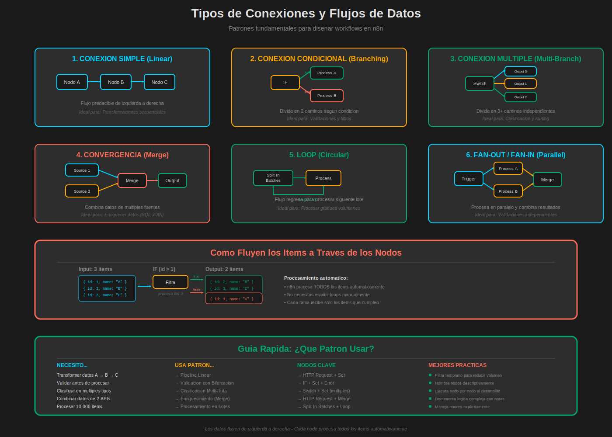

# Conexiones y Flujos de Datos en n8n

## 📋 Objetivos de Aprendizaje

Al finalizar este documento, serás capaz de:

- ✅ Entender cómo fluyen los datos entre nodos
- ✅ Crear conexiones simples y complejas
- ✅ Implementar flujos condicionales con múltiples ramas
- ✅ Combinar ramas que divergen y convergen
- ✅ Usar conexiones nombradas para claridad
- ✅ Depurar problemas de flujo de datos
- ✅ Aplicar patrones de diseño de workflows
- ✅ Optimizar el rendimiento del flujo de datos
- ✅ Manejar datos entre diferentes tipos de nodos

---

## 🎯 ¿Qué es un Flujo de Datos?

Un **flujo de datos** es el camino que siguen los datos desde el inicio hasta el final de tu workflow. En n8n, los datos se mueven a través de **conexiones** (líneas) entre **nodos** (bloques).

### Conceptos Fundamentales

**Item (elemento):**

- Unidad básica de datos
- Puede ser un objeto JSON, un array, un valor simple
- Cada item se procesa individualmente

**Conexión:**

- Línea que une dos nodos
- Define por dónde fluyen los datos
- Puede ser condicional (true/false) o directa

**Pipeline:**

- Secuencia completa de nodos conectados
- Transforma datos de entrada en salida final

---

## 🔗 Tipos de Conexiones



### 1. Conexión Simple (Linear)

La forma más básica: datos fluyen de izquierda a derecha.

```
Nodo A → Nodo B → Nodo C
```

**Ejemplo:**

```
HTTP Request → Set → Webhook Response
```

**Características:**

- ✅ Fácil de entender y mantener
- ✅ Flujo predecible
- ✅ Ideal para transformaciones secuenciales

---

### 2. Conexión Condicional (Branching)

El flujo se divide en múltiples caminos basándose en condiciones.

```
         → Nodo B (true)
Nodo A ↗
       ↘
         → Nodo C (false)
```

**Ejemplo con IF:**

```
HTTP Request → IF (age >= 18)
                ↓ true  → Send Welcome Email
                ↓ false → Send Parental Consent
```

**Características:**

- ✅ Permite decisiones en el workflow
- ✅ Cada rama procesa solo los items que cumplen su condición
- ⚠️ Las ramas son independientes (no se vuelven a unir automáticamente)

---

### 3. Conexión Múltiple (Multi-Branch)

Un nodo tiene múltiples salidas independientes.

```
         → Nodo B (Output 0)
Nodo A → → Nodo C (Output 1)
         → Nodo D (Output 2)
```

**Ejemplo con Switch:**

```
HTTP Request → Switch (por precio)
                ↓ Output 0 → Procesar pedidos baratos
                ↓ Output 1 → Procesar pedidos medios
                ↓ Output 2 → Procesar pedidos caros
```

**Características:**

- ✅ Hasta 4+ ramas diferentes
- ✅ Cada rama procesa items específicos
- ✅ Útil para clasificación y routing

---

### 4. Conexión de Convergencia (Merge)

Múltiples flujos se combinan en uno solo.

```
Nodo A →
         ↘
           Merge → Nodo D
         ↗
Nodo B →
```

**Ejemplo:**

```
HTTP Request (pedidos) →
                         ↘
                           Merge → Set → Output
                         ↗
HTTP Request (clientes) →
```

**Características:**

- ✅ Combina datos de múltiples fuentes
- ✅ Puede hacer joins tipo SQL
- ⚠️ Requiere configuración de qué datos combinar

---

### 5. Conexión de Loop (Circular)

El flujo regresa a un nodo anterior para procesar en bucle.

```
┌─────────────────────┐
│                     ↓
Nodo A → Nodo B → Nodo C
         (loop back)
```

**Ejemplo con Split In Batches:**

```
HTTP Request (100 items) → Split In Batches (10/lote)
                           ↓
                           Process Batch
                           ↓
                           ←─────┘ (loop back)
```

**Características:**

- ✅ Procesa datos en lotes
- ✅ Útil para grandes volúmenes
- ⚠️ Cuidado con loops infinitos

---

## 📊 Cómo Fluyen los Datos

### El Modelo de Items

En n8n, los datos se procesan como **arrays de items**:

```javascript
// Estructura interna
[
  { json: { id: 1, name: 'Juan' } },
  { json: { id: 2, name: 'María' } },
  { json: { id: 3, name: 'Pedro' } },
];
```

**Cada item tiene:**

- `json` → Los datos principales (objeto JSON)
- `binary` → Datos binarios opcionales (archivos, imágenes)

### Procesamiento Automático

**n8n procesa automáticamente todos los items:**

```
Input: 10 items
    ↓
Nodo Set (transforma cada uno)
    ↓
Output: 10 items transformados
```

**No necesitas escribir loops manualmente** - n8n lo hace por ti.

---

## 🎨 Patrones de Diseño de Workflows

### Patrón 1: Pipeline Lineal

**Caso de uso:** Transformación secuencial de datos.

```
┌─────────┐    ┌─────┐    ┌──────┐    ┌────────┐
│ Trigger │ → │ Get │ → │ Set  │ → │ Action │
└─────────┘    └─────┘    └──────┘    └────────┘
```

**Ejemplo real:**

```
Webhook → HTTP Request (API) → Set (limpiar) → Email (enviar)
```

**Ventajas:**

- ✅ Simple y fácil de depurar
- ✅ Predecible
- ✅ Rápido de construir

**Cuándo usar:** Procesos simples sin decisiones complejas.

---

### Patrón 2: Validación con Bifurcación

**Caso de uso:** Validar datos antes de procesar.

```
┌─────────┐    ┌────┐
│ Trigger │ → │ IF │ → true  → Process
└─────────┘    └────┘
                  ↓
                false → Error Handler
```

**Ejemplo real:**

```
Webhook → IF (tiene email válido?)
           ↓ true  → Save to Database
           ↓ false → Send Error Notification
```

**Ventajas:**

- ✅ Previene errores downstream
- ✅ Manejo explícito de casos inválidos
- ✅ Fácil de entender

**Cuándo usar:** Siempre que necesites validar entrada de datos.

---

### Patrón 3: Clasificación Multi-Ruta

**Caso de uso:** Procesar diferentes tipos de datos de forma distinta.

```
┌─────────┐    ┌────────┐
│ Trigger │ → │ Switch │ → Output 0 → Handler A
└─────────┘    └────────┘
                  ↓ Output 1 → Handler B
                  ↓ Output 2 → Handler C
                  ↓ Fallback → Error Log
```

**Ejemplo real:**

```
Webhook → Switch (por tipo de evento)
           ↓ 0 → Process Order
           ↓ 1 → Process Refund
           ↓ 2 → Process Cancellation
           ↓ 3 → Log Unknown Event
```

**Ventajas:**

- ✅ Organizado y escalable
- ✅ Fácil añadir nuevos casos
- ✅ Cada ruta es independiente

**Cuándo usar:** Webhooks que reciben múltiples tipos de eventos.

---

### Patrón 4: Enriquecimiento de Datos

**Caso de uso:** Combinar datos de múltiples fuentes.

```
┌─────────┐
│ Source1 │ →
└─────────┘    ┌───────┐    ┌─────┐
                │ Merge │ → │ Set │ → Output
┌─────────┐    └───────┘    └─────┘
│ Source2 │ →
└─────────┘
```

**Ejemplo real:**

```
HTTP Request (users) →
                       ↘
                         Merge (by user_id) → Set → Save
                       ↗
HTTP Request (orders) →
```

**Ventajas:**

- ✅ Datos completos y enriquecidos
- ✅ Equivalente a SQL JOIN
- ✅ Una sola petición final

**Cuándo usar:** Necesitas combinar datos de APIs diferentes.

---

### Patrón 5: Fan-Out / Fan-In

**Caso de uso:** Procesar datos en paralelo y luego combinar resultados.

```
         → Process A →
        ↗             ↘
Trigger               Merge → Output
        ↘             ↗
         → Process B →
```

**Ejemplo real:**

```
HTTP Request (pedido) →
  ↓ → Validate Stock →
  ↓ → Check Payment  → ↘
  ↓ → Verify Address → → Merge → Confirm Order
```

**Ventajas:**

- ✅ Procesamiento paralelo (más rápido)
- ✅ Validaciones independientes
- ✅ Combina resultados al final

**Cuándo usar:** Múltiples validaciones o transformaciones independientes.

---

### Patrón 6: Pipeline con Error Handling

**Caso de uso:** Capturar y manejar errores sin detener todo el workflow.

```
┌─────────┐    ┌─────┐    ┌─────┐
│ Trigger │ → │ Try │ → │ Set │
└─────────┘    └─────┘    └─────┘
                  ↓ (on error)
               ┌──────────────┐
               │ Error Handler│
               └──────────────┘
```

**Ejemplo real:**

```
Webhook → HTTP Request (puede fallar)
           ↓ success → Continue
           ↓ error   → Error Trigger (otro workflow) → Slack Alert
```

**Ventajas:**

- ✅ Workflow robusto
- ✅ No pierde datos en caso de error
- ✅ Notificación automática de problemas

**Cuándo usar:** APIs externas que pueden fallar.

---

### Patrón 7: Procesamiento en Lotes

**Caso de uso:** Procesar grandes volúmenes respetando rate limits.

```
┌─────────┐    ┌────────────────┐    ┌─────────┐
│ Trigger │ → │ Split In Batch │ → │ Process │
└─────────┘    └────────────────┘    └─────────┘
                       ↑                   ↓
                       └───────────────────┘
                            (loop back)
```

**Ejemplo real:**

```
HTTP Request (1000 users) →
  Split In Batches (50/lote) →
    Send Email →
      Wait 2 seconds →
        ←──────┘ (next batch)
```

**Ventajas:**

- ✅ No sobrecarga APIs
- ✅ Respeta rate limits
- ✅ Procesa volúmenes grandes

**Cuándo usar:** Envíos masivos de emails, sincronizaciones grandes.

---

## 🔍 Depuración de Flujos de Datos

### Técnica 1: Ejecutar Nodo por Nodo

**En lugar de ejecutar todo el workflow:**

1. Haz clic en un nodo
2. Click en **"Execute Node"**
3. Revisa el output
4. Continúa con el siguiente nodo

**Ventajas:**

- ✅ Detectas errores rápidamente
- ✅ Entiendes cómo cambian los datos
- ✅ Validás cada paso

---

### Técnica 2: Usar NoOp como Breakpoint

**Añade nodos NoOp para "pausar" el flujo:**

```
Nodo A → NoOp → Nodo B → NoOp → Nodo C
         ↑               ↑
     checkpoint 1    checkpoint 2
```

**Beneficios:**

- ✅ Puedes ver los datos en puntos específicos
- ✅ Fácil de activar/desactivar ramas
- ✅ No modifica los datos

---

### Técnica 3: Añadir Nodos de Logging

**Usa Code nodes para logging temporal:**

```javascript
// Code Node para debugging
console.log('Items recibidos:', items.length);
console.log('Primer item:', JSON.stringify(items[0].json, null, 2));

// Detectar items problemáticos
items.forEach((item, index) => {
  if (!item.json.email) {
    console.log(`Item ${index} sin email:`, item.json);
  }
});

// Pasar datos sin modificar
return items;
```

**Revisa la consola del navegador (F12) para ver los logs.**

---

### Técnica 4: Visualizar el Flujo de Items

**Después de ejecutar, cada nodo muestra:**

```
┌─────────────┐
│   Nodo A    │
│  ✓ 10 items │  ← Cantidad de items procesados
└─────────────┘
```

**Símbolo de estado:**

- ✓ Verde → Éxito
- ✗ Rojo → Error
- ○ Gris → No ejecutado

---

## 🎯 Ejercicios Prácticos

### Ejercicio 1: Pipeline con Validación

**Objetivo:** Crear un flujo que valide y procese usuarios.

**Requisitos:**

1. Obtén usuarios de: `https://jsonplaceholder.typicode.com/users`
2. Usa IF para filtrar solo usuarios con email válido (contiene "@")
3. Rama true: Transforma con Set (id, name, email)
4. Rama false: Usa Stop and Error con mensaje descriptivo
5. Ejecuta y verifica que solo procesan los válidos

**Pista:** Usa la expresión: `{{ $json.email.includes('@') }}`

---

### Ejercicio 2: Clasificación Multi-Ruta

**Objetivo:** Clasificar posts por longitud del contenido.

**Requisitos:**

1. Obtén posts de: `https://jsonplaceholder.typicode.com/posts`
2. Usa Switch para clasificar por `body.length`:
   - Output 0: Cortos (< 100 caracteres)
   - Output 1: Medios (100-200)
   - Output 2: Largos (> 200)
3. Añade un Set en cada rama con campo `categoria`
4. Ejecuta y cuenta cuántos posts hay en cada categoría

---

### Ejercicio 3: Enriquecimiento de Datos

**Objetivo:** Combinar usuarios con sus posts.

**Requisitos:**

1. Obtén users: `https://jsonplaceholder.typicode.com/users`
2. Obtén posts: `https://jsonplaceholder.typicode.com/posts`
3. Usa Merge (by userId y id)
4. Configura como Left Join (mantener todos los users)
5. Usa Set para crear output limpio: `userName`, `userEmail`, `postTitle`
6. Verifica que cada user tiene sus posts asociados

---

### Ejercicio 4: Pipeline con Lotes

**Objetivo:** Procesar albums en lotes con delays.

**Requisitos:**

1. Obtén albums: `https://jsonplaceholder.typicode.com/albums`
2. Usa Split In Batches (10 albums por lote)
3. Procesa cada lote con Set
4. Añade Wait node (1 segundo)
5. Conecta el loop correctamente
6. Ejecuta y observa cómo procesa lote por lote

---

## 💡 Mejores Prácticas

### 1. Organización Visual

**❌ Evita:**

```
Nodos desordenados, líneas cruzadas, sin espaciado
```

**✅ Hazlo bien:**

- Flujo de izquierda a derecha
- Espaciado consistente entre nodos
- Ramas claramente separadas
- Usa colores para agrupar nodos relacionados

---

### 2. Nomenclatura Descriptiva

**❌ Evita:**

```
IF
Set
HTTP Request
```

**✅ Hazlo bien:**

```
IF - Validar Email
Set - Normalizar Datos de Usuario
HTTP Request - Obtener Pedidos de Shopify
```

---

### 3. Documentación con Notas

**Añade notas a nodos complejos:**

```
Right-click → Add Note → Escribe explicación

"Este IF valida que el email sea válido antes de
procesar el pedido. Los inválidos van a error log."
```

---

### 4. Manejo de Errores

**Siempre planifica qué pasa si algo falla:**

```
HTTP Request (puede fallar)
  ↓ success → Continue
  ↓ error   → Error Trigger → Alert Team
```

**Opciones:**

- Stop and Error (detiene todo)
- Error Trigger (workflow separado que maneja errores)
- IF con validación previa

---

### 5. Testing Incremental

**No construyas todo y luego pruebes:**

1. Crea primer nodo → Ejecuta → Verifica
2. Añade segundo nodo → Ejecuta → Verifica
3. Continúa paso a paso

**Ventajas:**

- ✅ Detectas errores temprano
- ✅ Entiendes el flujo de datos
- ✅ Menos tiempo de debugging

---

### 6. Optimización de Performance

**Orden de eficiencia:**

```
Más rápido:
  1. Filtrar primero (IF, Switch)
  2. Luego transformar (Set)
  3. Por último procesar (Code, APIs)

Menos rápido:
  1. Procesar todo
  2. Luego filtrar
  3. Descarta lo no necesario
```

**Regla:** Reduce el volumen de datos lo antes posible.

---

## 🐛 Troubleshooting: Problemas Comunes

### Problema 1: "This item is empty"

**Causa:** Un nodo anterior no devolvió ningún item.

**Soluciones:**

1. Ejecuta el nodo anterior y verifica su output
2. Revisa si un IF filtró todos los items
3. Verifica que la API devolvió datos

---

### Problema 2: Conexiones Rotas

**Causa:** Moviste nodos y se desconectaron.

**Soluciones:**

1. Revisa visualmente que todas las líneas estén conectadas
2. Ejecuta workflow - n8n te avisará de nodos desconectados
3. Reconecta arrastrando desde el círculo de salida al de entrada

---

### Problema 3: Loop Infinito

**Causa:** Loop mal configurado en Split In Batches.

**Soluciones:**

1. Verifica que el último nodo del loop se conecte al **input** del Split In Batches
2. No conectes a nodos antes del Split In Batches
3. Asegúrate de que Split In Batches esté configurado correctamente

---

### Problema 4: Merge Devuelve 0 Items

**Causa:** Los campos de join no coinciden.

**Soluciones:**

1. Ejecuta ambos inputs por separado
2. Verifica los nombres de campos exactos (mayúsculas/minúsculas)
3. Verifica los tipos de datos (string vs number)
4. Usa Code node para normalizar campos antes del Merge

---

### Problema 5: Datos No Se Transforman

**Causa:** Expresiones en Set incorrectas.

**Soluciones:**

1. Verifica la sintaxis: `{{ $json.campo }}`
2. Ejecuta el nodo anterior para ver qué campos tiene
3. Usa el editor de expresiones (click en fx)
4. Prueba expresiones simples primero

---

## 📊 Visualización de Flujos Complejos

### Estrategia de Capas

**Para workflows grandes, organiza por capas:**

```
Capa 1: Input/Triggers
    ↓
Capa 2: Validación/Filtrado
    ↓
Capa 3: Transformación/Enriquecimiento
    ↓
Capa 4: Procesamiento/Acciones
    ↓
Capa 5: Output/Notificaciones
```

**Beneficios:**

- ✅ Fácil de entender visualmente
- ✅ Fácil de mantener
- ✅ Se puede trabajar por capas

---

### Uso de Colores

**Estandariza colores por función:**

- 🔵 **Azul** → Triggers y entrada de datos
- 🟢 **Verde** → Transformaciones y lógica
- 🟡 **Amarillo** → APIs externas
- 🟠 **Naranja** → Procesamiento crítico
- 🔴 **Rojo** → Errores y alertas

**Cómo cambiar color:**

```
Right-click en nodo → Change Color → Elige color
```

---

## 🎓 Conceptos Avanzados

### Acceso a Datos de Nodos Anteriores

**Puedes acceder a datos de nodos específicos:**

```javascript
// Desde el nodo actual
{
  {
    $json.campo;
  }
}

// Desde un nodo específico por nombre
{
  {
    $node['HTTP Request'].json.campo;
  }
}

// Desde un nodo por posición
{
  {
    $items('HTTP Request')[0].json.campo;
  }
}

// Acceder a todos los items de un nodo
{
  {
    $items('HTTP Request').length;
  }
}
```

---

### Manejo de Multiple Outputs

**Algunos nodos tienen múltiples outputs (Switch):**

```javascript
// En un nodo después del Switch
// Recibes solo los items de esa rama específica

// Output 0 solo ve items de Output 0
// Output 1 solo ve items de Output 1
// etc.
```

---

### Propagación de Errores

**Cómo n8n maneja errores:**

1. Error en un nodo → Workflow se detiene
2. Marca el workflow como "error"
3. Items procesados hasta ese punto se mantienen
4. Puedes capturar con Error Trigger

**Configurar retry:**

```
Settings del nodo → Continue On Fail
- Enabled: El workflow continúa aunque falle
- Retry: Intenta X veces antes de fallar
```

---

## 📚 Recursos Adicionales

### Documentación Oficial

- [Workflow Concepts](https://docs.n8n.io/workflows/)
- [Data Flow](https://docs.n8n.io/workflows/executions/)
- [Error Handling](https://docs.n8n.io/workflows/error-handling/)

### Tutoriales de la Comunidad

- [n8n Workflow Patterns](https://community.n8n.io/c/tutorials/18)
- [Common Workflow Templates](https://n8n.io/workflows/)

---

## 🔜 Siguiente Paso

En el último documento del módulo, **"Ejecución y Testing"**, aprenderás:

- Diferentes modos de ejecución
- Testing de workflows
- Debugging avanzado
- Monitoreo de ejecuciones
- Optimización de performance
- Deploy a producción

**📝 Prepárate:** Practica los 4 ejercicios de este documento. Los patrones de diseño que aprendiste aquí son fundamentales para construir workflows profesionales.

---

## 🎓 Lo Que Has Aprendido

¡Felicidades! Ahora dominas las conexiones y flujos de datos en n8n:

✅ **Tipos de conexiones:** Simple, condicional, múltiple, convergencia, loops
✅ **Modelo de items:** Cómo n8n procesa datos internamente
✅ **Patrones de diseño:** 7 patrones probados para workflows comunes
✅ **Debugging:** Técnicas para depurar flujos complejos
✅ **Mejores prácticas:** Organización, nomenclatura, testing
✅ **Troubleshooting:** Solución de problemas comunes
✅ **Conceptos avanzados:** Acceso a nodos, múltiples outputs, manejo de errores

**🎯 Siguiente hito:** Con estos fundamentos, estás listo para construir workflows complejos y robustos. El próximo documento cierra el módulo con ejecución y testing profesional.
